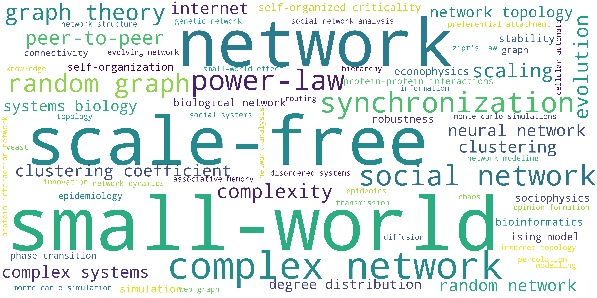
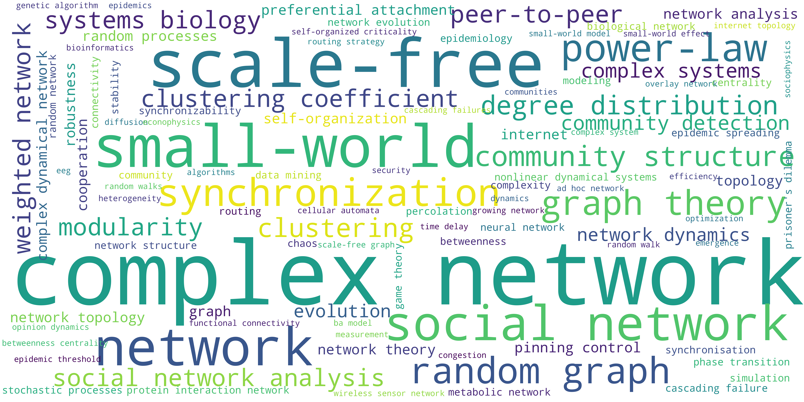
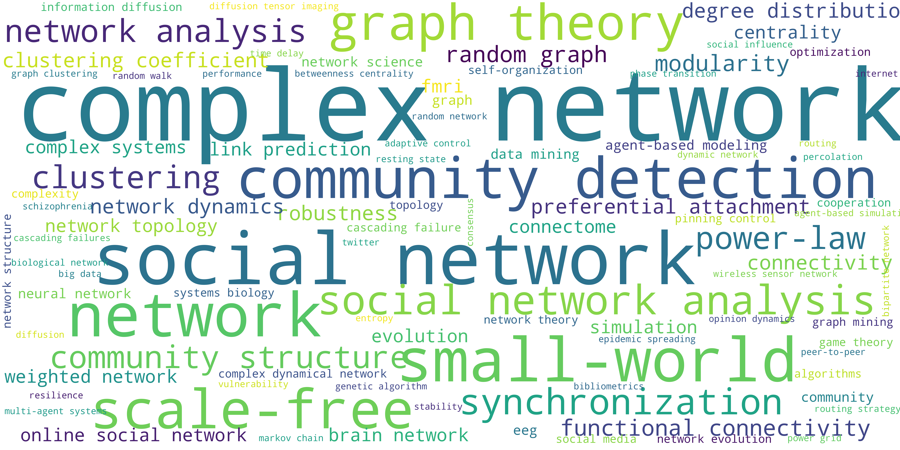
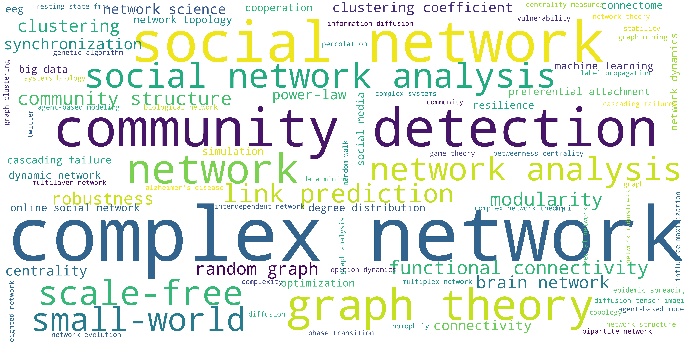

# Two-Decades-of-Network-Science
Supplementary data for the paper *Two Decades of Network Science - as seen through the co-authorship network of network scientists* - R. Molontay, M. Nagy (2019)

The paper can be found at [this arxiv link](https://arxiv.org/abs/1908.08478).

__Note that there is an extended version of this work that can be found at [this repository](https://github.com/marcessz/Twenty-Years-of-Network-Science/blob/master/README.md). Moreover, you can read the paper [here](https://link.springer.com/chapter/10.1007/978-3-030-67044-3_1)__

## How to Cite
```
@inproceedings{molontay2019two,
  title={Two Decades of Network Science - as seen through the co-authorship network of network scientists},
  author={Molontay, Roland and Nagy, Marcell},
  booktitle={2019 IEEE/ACM International Conference on Advances in Social Networks Analysis and Mining (ASONAM)},
  pages={578--583},
  year={2019},
  organization={IEEE}
  }
```

## Source
The data were collected from the Web of Science core collection. We downloaded information about the articles that cited at least one of the following papers: 
* Barabási, A. L., & Albert, R. (1999). Emergence of scaling in random networks. Science, 286(5439), 509-512.
* Watts, D. J., & Strogatz, S. H. (1998). Collective dynamics of ‘small-world’networks. Nature, 393(6684), 440.
* Girvan, M., & Newman, M. E. (2002). Community structure in social and biological networks. Proceedings of the national academy of sciences, 99(12), 7821-7826.


## Data

The edgelist of the constructed network can be found in [this folder](./network-edge-list). Moreover, it can be also found in the [Index of Complex Network (ICON)](https://icon.colorado.edu/#!/networks), titled 'Network scientist coauthorships (2019)'.

## Word clouds of the keywords
We divided the two decades into the following four periods: 1989-2005, 2006-2010, 2011-2015 and 2016-2019 (May). 
The following four figures show the word clouds of the keywords of the articles written in the four periods respectively.
### Between 1998 and 2005

### Between 2006 and 2010

### Between 2010 and 2015

### Between 2016 and 2019 (May)

